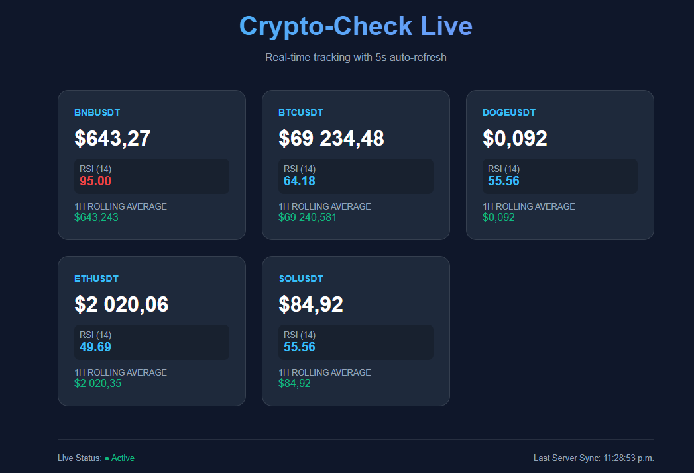

# Go Learning & FinTech Pet Projects

This repository contains my practice projects in Golang, focused on building robust, concurrent financial data processing systems.

---

## Crypto-Check (Binance Monitor)

  

A real-time cryptocurrency price monitor designed with standard practices. This project evolved from a simple scraper into a modular microservice with persistent storage, analytics, and a live dashboard.

### Key Features

* **High Concurrency:** Uses goroutines and `sync.WaitGroup` to track multiple symbols simultaneously without blocking the system.
* **Live Web Dashboard:** A responsive English UI that displays real-time market data with 5-second automatic updates (no page refresh required).
* **RESTful API:** Integrated web server providing statistical data in JSON format for external integrations.
* **Persistent Storage:** Integrated **SQLite** to keep track of price history with optimized data retrieval.
* **Real-time Analytics:** Calculates **1-Hour Rolling Averages** directly via SQL queries to monitor market trends.
* **Modular Architecture:** Cleanly separated into `monitor`, `database`, `server`, and `structs` (Models) for better maintainability.
* **Smart Logging:** Implements a full logging hierarchy (DEBUG, INFO, ERROR) with console and file output.
* **External Configuration:** Fully driven by a `config.json` file for flexible symbol management and intervals.
* **Frontend-Backend Sync:** Uses JavaScript **Fetch API** to asynchronously bridge the Go backend with the user interface.
* **Dockerized:** Fully containerized environment for consistent deployment across any system (Windows, Mac, Linux).

### Tech Stack

* **Language:** Golang (Concurrency, Context, `net/http`)
* **Database:** SQLite (SQL, Time-series data analytics)
* **Frontend:** HTML5, CSS3 (Modern UI), JavaScript (ES6 Fetch API)
* **Containerization:** Docker (Multi-stage builds)
* **API:** Binance Public REST API
* **Architecture:** Modular Data-driven design / RESTful service
* **Automated Testing:** Implements **Table Driven Tests** for core logic, price calculations, and JSON validation with code coverage reporting.

---

## 🐳 Running with Docker

The project is fully containerized.

1. **Build :** 
docker build -t crypto-app .
2. **Run the container :**
docker run -p 8080:8080 crypto-app
3. **Access the dashboard :**
Open http://localhost:8080 in your browser.

### Roadmap

[x] Concurrent price fetching

[x] JSON Configuration system

[x] Multi-level logging & Alerts

[x] SQLite database integration & Analytics

[x] REST API & Live Web Dashboard

[x] Docker containerization

[x] Unit testing (Table-driven approach)

[ ] gRPC interface implementation