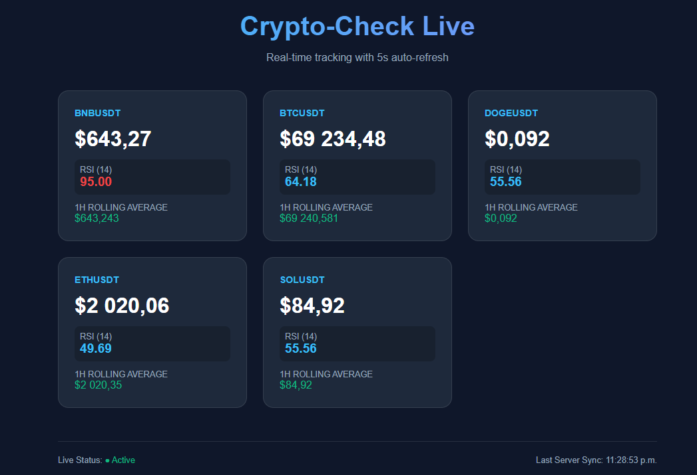

# Go Learning & FinTech Pet Projects

This repository contains my practice projects in Golang, focused on building robust, concurrent financial data processing systems with a microservices approach.

---

## Crypto-Check (Microservices Binance Monitor)

<p align="center">
  
</p>

A real-time cryptocurrency monitoring system built with a **microservices architecture**. The project demonstrates inter-service communication using gRPC, persistent storage, and real-time data visualization.

### 🏗 Architecture Overview

The system is split into two specialized services that communicate via high-performance **gRPC**:

1.  **Collector Service:** * Fetches real-time prices from Binance API using high concurrency (Goroutines).
    * Manages persistent storage in **SQLite**.
    * Acts as a Gateway, serving the Web Dashboard and REST API.
2.  **Analytics Service:** * A dedicated gRPC server that performs technical analysis.
    * Calculates indicators like **RSI (Relative Strength Index)** on-demand.
    * Decouples heavy calculations from the data ingestion flow.

### Key Features

* **Microservices & gRPC:** Implements strict service contracts using **Protocol Buffers (proto3)** and gRPC for fast, type-safe internal communication.
* **Real-time Technical Analysis:** Dynamic **RSI** calculation based on historical price data stored in a shared SQLite volume.
* **High Concurrency:** Efficiently tracks multiple symbols simultaneously using `sync.WaitGroup` and `Context`.
* **Live Web Dashboard:** Responsive UI with 5-second automatic updates and visual indicators for Market Status (Overbought/Oversold).
* **Dockerized Ecosystem:** Multi-container setup managed via **Docker Compose**, including shared volumes for data persistence.
* **Automated Testing:** Table Driven Tests for core logic, price calculations, and gRPC message validation.

### Tech Stack

* **Backend:** Golang (gRPC, Protobuf, Concurrency, `net/http`)
* **Database:** SQLite (Shared persistent storage)
* **Communication:** gRPC (Internal), REST (External/Frontend)
* **Frontend:** HTML5, CSS3, JavaScript (Async Fetch API)
* **Infrastructure:** Docker & Docker Compose
* **API:** Binance Public REST API

---

## 🐳 Running the Project

The entire ecosystem is orchestrated with Docker Compose for a one-command setup.

1.  **Clone the repo:**
    ```bash
    git clone [https://github.com/your-username/GoProjects.git](https://github.com/your-username/GoProjects.git)
    cd GoProjects/crypto-check
    ```
2.  **Start all services:**
    ```bash
    docker-compose up --build
    ```
3.  **Access the dashboard:**
    Open [http://localhost:8080](http://localhost:8080) in your browser.

---

### Roadmap

- [x] Concurrent price fetching & JSON Configuration
- [x] SQLite database integration & Time-series analytics
- [x] REST API & Live Web Dashboard
- [x] **Microservices Transition: Split Collector and Analytics**
- [x] **gRPC Implementation for inter-service communication**
- [x] Docker Compose orchestration
- [x] Unit testing (Table-driven approach)